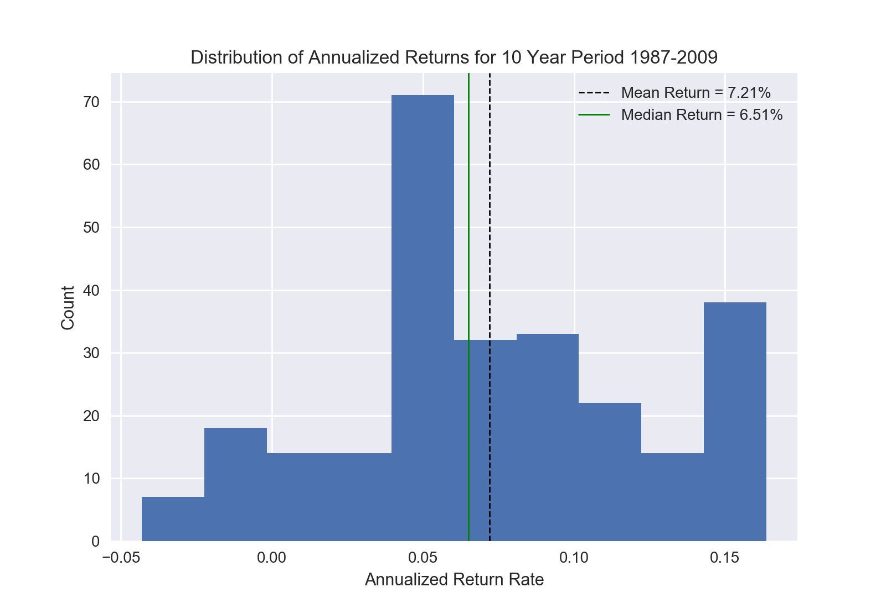
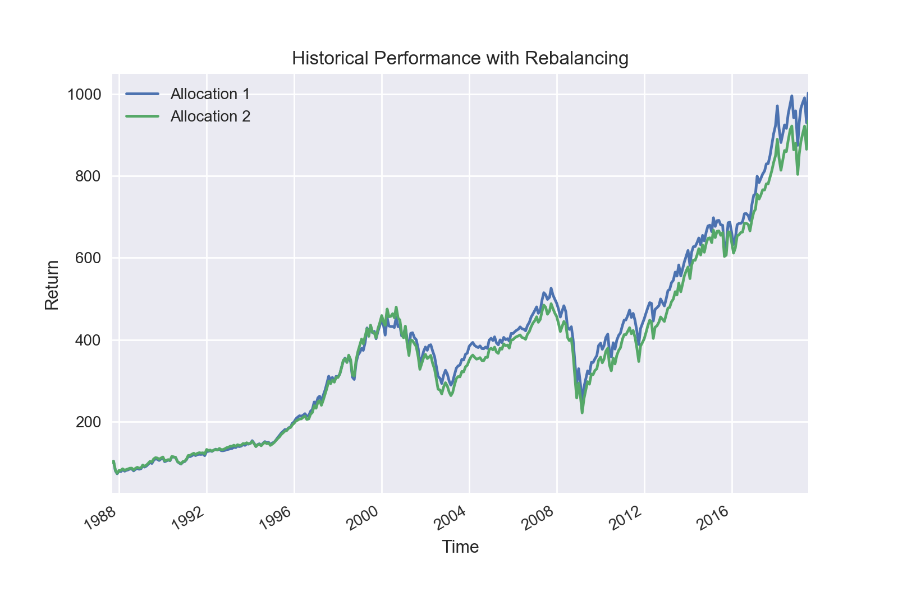

# Backtest
This package aims to provide a very basic backtesting platform that assumes a portfolio rebalances every month or quarter to a static portfolio weighting.

A few examples through graphs:

Running distribution.py:

Running returns.py
